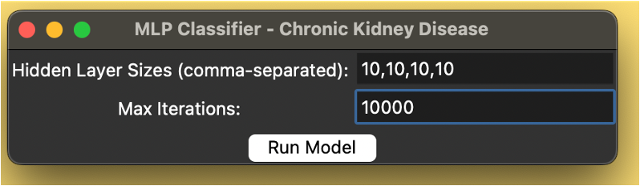
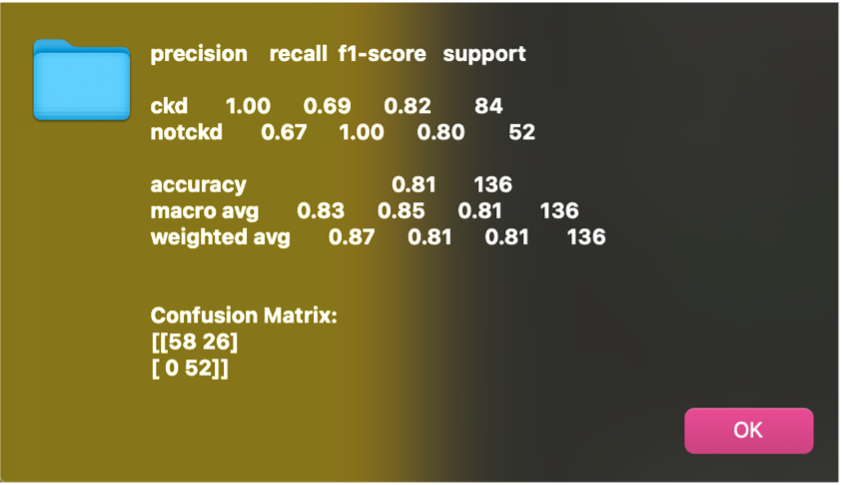
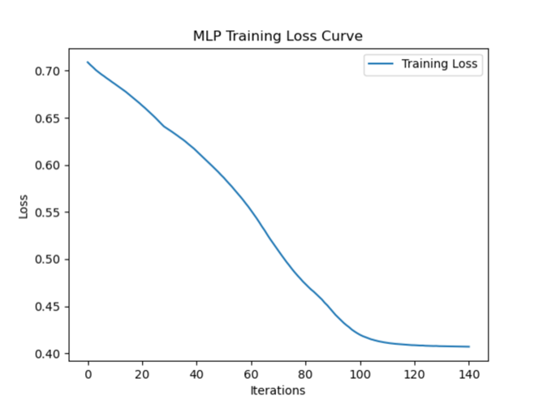
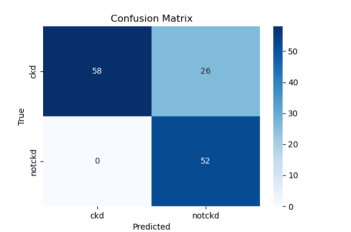

# Kronik Böbrek Hastalığı (CKD) Tahmin Projesi

Bu proje, sağlık verilerini kullanarak yapay sinir ağları eğitimi ile kronik böbrek hastalığı (Chronic Kidney Disease, CKD) tanısı koymayı amaçlamaktadır. MLP Classifier (Multi-Layer Perceptron) kullanılarak hastaların sağlık verileri analiz edilmekte ve CKD olup olmadıkları tahmin edilmektedir.

## Proje Amacı
Kronik Böbrek Hastalığı (CKD), böbreklerin uzun süreli olarak zarar görmesi durumudur. Bu proje, kişilerin sağlık bilgilerini kullanarak CKD hastalığına sahip olup olmadıklarını tahmin etmeyi amaçlamaktadır.

## Kullanılacak Özellikler
### Sayısal Özellikler:
- **age**: Yaş
- **bp**: Kan basıncı
- **sg**: Spesifik ağırlık (specific gravity)
- **bgr**: Kan şekeri düzeyi
- **bu**: Kan üre nitrojeni
- **al**: Albumin (idrar testi için bir protein türü)
-	**su**: İdrar yoğunluğu (urine sugar)
-	**bgr**: Kan şekeri düzeyi (blood glucose random)
-	**sc**: Serum kreatinin seviyesi (serum creatinine)
-	**sod**: Serum sodyum seviyesi (serum sodium)
- **po**t: Serum potasyum seviyesi (serum potassium)
-	**hemo**: Hemoglobin seviyesi (hemoglobin)
-	**pcv**: Hematokrit seviyesi (packed cell volume)
-	**wbcc**: Beyaz kan hücresi sayısı (white blood cell count)
-	**rbcc**: Kırmızı kan hücresi sayısı (red blood cell count)

### Kategorik Özellikler:
- **rbc**: Kırmızı kan hücresinin varlığı (present/absent)
- **htn**: Hipertansiyon (yes/no)
- **dm**: Diyabet (yes/no)
-	**pc**: İdrarda proteinin varlığı (present/absent)
-	**pcc**: İdrarda kanın varlığı (present/absent)
-	**ba**: Anemi varlığı (present/absent)
-	**cad**: Koroner arter hastalığı (yes/no)
-	**appet**: İştah durumu (good/poor)
-	**pe**: Ödem (yes/no)
-	**ane**: Anemi (yes/no)

## Projenin Çıktısı:
Proje sonunda, kullanıcının girdiği sağlık verileriyle bir kişinin Kronik Böbrek Hastalığına sahip olup olmadığı tahmin edilecektir. Modelin doğruluğu, classification report ve confusion matrix gibi performans metrikleriyle değerlendirilecektir. Ayrıca, cross-validation ve GridSearchCV gibi yöntemlerle modelin parametreleri optimize edilecektir.

Aynı zamanda projede Tkinter kullanılarak bir grafiksel kullanıcı arayüzü (GUI) başlatılır. Bu sayede kullanıcıdan hidden_layer_sizes (gizli katman büyüklükleri) ve max_iter (maksimum iterasyon sayısı) parametreleri alınır. Model eğitildikten sonra sonuçlar hem GUI üzerinde bir messagebox aracılığıyla kullanıcılara gösterilir hem de ekran çıktısı olarak yazdırılır. 

Ardından, modelin doğruluğunu değerlendirmek için cross_val_score fonksiyonu ile 5 katlı ve 10 katlı çapraz doğrulama (cross-validation) gerçekleştirilir ve sonuçlar ekranda gösterilir. Son olarak, modelin eğitim sürecindeki kayıp (loss) eğrisinin görselleştirilmesi için matplotlib kütüphanesi kullanılarak eğitim kaybı grafiği çizilir ve kullanıcıya sunulur. 

### Bu proje, sağlık alanında erken teşhis ve doğru sınıflandırma için önemli bir adım olabilir, çünkü erken aşamada teşhis edilen CKD, tedavi sürecinde büyük fark yaratabilir.
